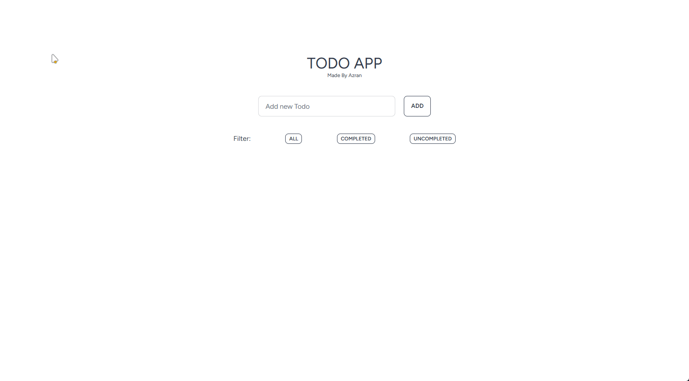

# Simple TODO App

## Overview

This project is about creating a straightforward TODO app using Laravel, Inertia.js, and Vue.js. 


## Architecture
- Has a single page application frontend. `resources/js/Pages/home.vue` contains the frontend code.
- Has 4 route with inertia
    - `GET /` - Home page
    - `POST /` - Create task 
    - `PUT /` - Toggle task completion status
    - `DELETE /{id}` - Delete task
- Has a single controller `TaskController` which handles all the CRUD operations.
## Technology Stack

- **Laravel:** Backend framework.
- **Inertia.js & Vue.js:** SPA Frontend development.
- **MySQL:** Database for task storage.
- **Tailwind CSS & DaisyUI:** Styling the app.

## Key Features

- Users can create, view, delete tasks.
- Task completion status can be marked.
- Tasks can be filtered based on their completion status.

## Demo 



### Setup

- Clone the repository
- Install dependencies
    ```bash
    composer install
    npm install
    ```
- Create a `.env` file from `.env.example` and update the database credentials.
- Run the migrations
    ```bash
    php artisan migrate
    ```
- Run the server
    ```bash
    php artisan serve
    ```
- Visit `http://localhost:8000` to view the app.


<br><br>

<em>This project was created as a part of iniLabs Internship Assignment.</em>
